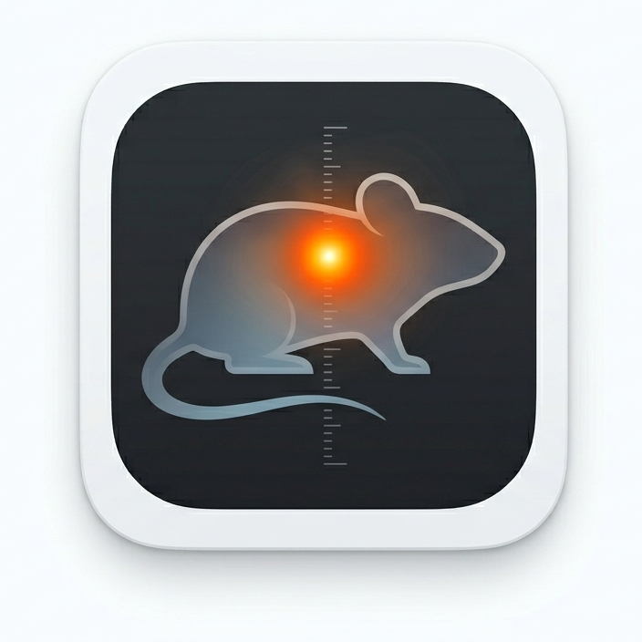

<p align="center">
  
</p>

<h1 align="center">Glöd — Parallel Thermal Imaging Analysis</h1>

<p align="center">
  <em>A desktop application for long-term, parallelised body temperature experiments in rodents.</em>
</p>

---

Glöd lets researchers in **neuroscience, metabolic syndrome, endocrinology**, and related fields run multiple thermal cameras simultaneously, then analyse all recordings in one place — from raw sensor CSV files to publication-ready figures and statistical tests.
No coding required. Point it at your data folders, configure your groups, click **Run**.

Built with Waveshare MI48x3 thermal cameras and tested at Karolinska Institutet.

---

## About the Name

*Glöd* is Swedish for **glow** or **live embers** — evoking both the warm hotspots visible in thermal imagery and the slow, sustained physiological processes the tool is designed to track. The Scandinavian aesthetic carries through into the UI theme.

---

## Who Is This For?

Glöd is designed for researchers who:

- Study **thermoregulation**, **circadian rhythms**, **fever responses**, **metabolic syndrome**, or **endocrine function** in rodents
- Need to run **long-term parallel recordings** across multiple animals or experimental groups simultaneously
- Want a **single pipeline** from raw camera output to statistical results and publication-worthy graphs — without writing custom analysis code

The target organisms are mice and rats, though sensor dimensions, FPS, and ROI parameters are all user-configurable.

---

## Hardware Setup

This project was developed using three **[Waveshare Thermal USB Cameras (B)](https://www.waveshare.com/wiki/Thermal_USB_Camera_(B)?srsltid=AfmBOoreoDCSu5Yau3DvoxuaR3LtRhWDU4QvdC0lfTemWEkDUbIstE-_)** running in parallel — one camera per animal or cage.

Each camera:
- Costs ~$50 USD — budget-friendly for multi-animal setups
- Uses the **MI48x3** sensor at 80 × 62 px, 10 FPS
- Connects via USB and records directly to CSV files via the Waveshare software

Running three cameras simultaneously enables true parallel data collection from multiple experimental groups with no synchronisation overhead.

---

## Quick Start

```bash
conda activate glod
python run_glod.py
```

---

## Environment

| Item | Value |
|---|---|
| Conda env | `glod` (created with `conda create -n glod python=3.11`) |
| Python | 3.11 |
| Key packages | PyQt6 · matplotlib · numpy · scipy · pandas · opencv-python-headless · statsmodels · scikit-posthocs |

To recreate the environment from scratch:

```bash
conda create -n glod python=3.11 -y
conda activate glod
pip install PyQt6 matplotlib numpy scipy pandas opencv-python-headless statsmodels scikit-posthocs pillow
```

---

## Camera / Data Format

**Waveshare Thermal USB Camera (B) — MI48x3 sensor**

| Parameter | Value |
|---|---|
| Resolution | 80 × 62 pixels = 4 960 px/frame |
| Data format | CSV, no header; 4 968 columns/line |
| Metadata cols | 0–7 (ISO timestamp + 7 values) |
| Pixel cols | 8–4967 (float °C values) |
| Default FPS | 10 (user-changeable in UI) |

The UI lets you override Width, Height, and metadata column count to support other sensors.

---

## Project Structure

```
glod/
├── run_glod.py                       # top-level launcher
├── icon.png / icon.ico               # app icon
├── requirements.txt
└── thermal_analysis/
    ├── main.py                       # QApplication entry point
    ├── ui/
    │   ├── main_window.py            # MainWindow (splitter layout)
    │   ├── group_widget.py           # FolderGroupWidget (per-group card)
    │   ├── plot_panel.py             # PlotCanvas + PlotScrollPanel
    │   └── theme.py                  # Scandinavian Light QSS stylesheet
    ├── processing/
    │   ├── parser.py                 # Vectorised CSV parser + ProcessPoolExecutor
    │   ├── roi_analysis.py           # All ROI algorithms + T_core estimation
    │   ├── stats.py                  # Statistical test engine
    │   ├── workers.py                # QThread workers (ParseWorker, VideoWorker)
    │   └── video_exporter.py         # Multi-panel OpenCV video export
    ├── plotting/
    │   └── figure_builder.py         # 10 matplotlib figure builders
    └── utils/
        └── config.py                 # Constants + AnalysisSettings dataclass
```

---

## Usage

1. Launch the app.
2. **Add Group** — click `✚ Add Group`, name it, pick a colour, browse to a folder of `.txt` files.
3. Configure **Camera Settings** (Width=80, Height=62, FPS=10 for MI48x3 — pre-filled).
4. Choose **ROI mode**: *Dynamic* (auto-centers on hottest pixel each frame) or *Fixed Box* (manual X/Y).
5. Optionally enable **Emissivity Correction** (ε mouse=0.93, ε sensor=1.00).
6. Optionally enable **T_core Estimation** (van der Vinne et al., 2020).
7. Click **▶ Run Analysis**.
8. Plots appear in the right panel; CSVs are written to the output directory.
9. To export video: tick **Export video** on a group card *before* running, or click **Export Video** after.

---

## Output Files

```
glod_output_YYYYMMDD_HHMMSS/
├── {GroupName}/
│   ├── {stem}_roi_data.csv           # per-frame: time_s, roi_mean, roi_max, normalized, max_row/col
│   ├── {stem}_tcore_estimated.csv    # per-sample: time_s, tskin_max, tcore_estimated
│   ├── group_roi_summary.csv         # group mean ± SEM on 30-s grid
│   ├── group_tcore_summary.csv
│   └── {GroupName}_roi_video.mp4     # (if export checked)
├── per_file_metrics.csv              # scalar summary per camera file (the stat unit)
├── statistical_tests.csv             # test name, statistic, p, effect size per metric
├── posthoc_tests.csv                 # pairwise post-hoc (3+ groups only)
└── multi_group_timeseries.csv        # all groups side-by-side on common time axis
```

---

## Algorithms

### ROI Analysis
- **Dynamic ROI**: centres a user-sized box on the hottest pixel each frame.
- **Static ROI**: fixed bounding box at user-specified coordinates.
- **Emissivity correction**: Stefan-Boltzmann — `T_true = (T_K⁴ × ε_sensor / ε_true)^0.25 − 273.15`
- **Spatial smoothing**: 3D Gaussian on the full (N, H, W) stack (`σ=0.5` default).
- **Temporal smoothing**: Savitzky-Golay (`window=11, poly=3`).
- **Normalisation**: `(x − baseline_mean) / baseline_mean` using first 300 s.

### T_core Estimation — van der Vinne et al. (2020) *Sci Rep* 10:20680
1. Divide frames into 60-s sampling blocks; take **maximum** T_skin per block.
2. Apply 30-min rolling mean → T_skin,max rolling average.
3. Linear transform: **T_core = 0.93 × T_skin,max + 7.1 °C**

> ⚠ Between-animal error ≈ ±0.9 °C. Values reflect relative thermal dynamics reliably; absolute T_core values should be interpreted with caution.

### Statistical Tests
| Groups | Normality (Shapiro-Wilk, n ≥ 3) | Test | Post-hoc |
|---|---|---|---|
| 2 | Pass | Welch t-test + Cohen's d | — |
| 2 | Fail / n < 3 | Mann-Whitney U + rank-biserial r | — |
| 3+ | Pass | One-way ANOVA + η² | Tukey HSD (Bonferroni) |
| 3+ | Fail / n < 3 | Kruskal-Wallis | Dunn's test (Bonferroni) |

Metrics tested: peak normalised ROI, AUC normalised ROI, time to peak, peak T_core, AUC T_core.

---

## Plots Generated

| # | Plot | Description |
|---|---|---|
| 1 | Normalised ROI | Multi-group ΔT from baseline + SEM + poly fit |
| 2 | Rate of Change (ROI) | °C/min derivative, Gaussian-smoothed |
| 3 | ROI Max vs Mean | Per-file max (solid) vs mean (dashed) |
| 4 | Max Pixel Temperature | Per-file hottest pixel + rolling SD band |
| 5 | Max Pixel Movement | Spatial trajectory scatter + visit heatmap |
| 6 | Absolute ROI | Un-normalised absolute temperatures, multi-group |
| 7 | Estimated T_core | Dual panel: T_skin,max rolling avg + T_core est. |
| 8 | T_core Rate of Change | d(T_core)/dt in °C/min |
| 9 | Group Comparison Bars | Bar + jitter + significance brackets |
| 10 | Violin / Box | Distribution per metric, significance brackets |

---

## Known Limitations

- With only 1 file per group, SEM = 0 (no spread information).
- T_core 30-min window requires ≥ 30 min of recording to fully fill; shorter recordings use `min_periods=1`.
- Video export is sequential — if multiple groups have "Export video" ticked, they export one at a time.
- The IDE (VS Code) may show false "Cannot find module PyQt6" errors because it uses the system Python 3.9. The app runs correctly in the `glod` conda env.

---

## AI Disclaimer

Parts of this codebase were developed with the assistance of AI tools (Claude by Anthropic). All experimental design, scientific decisions, and algorithmic choices were made by the researcher; AI assistance was used for implementation, code review, and debugging.
